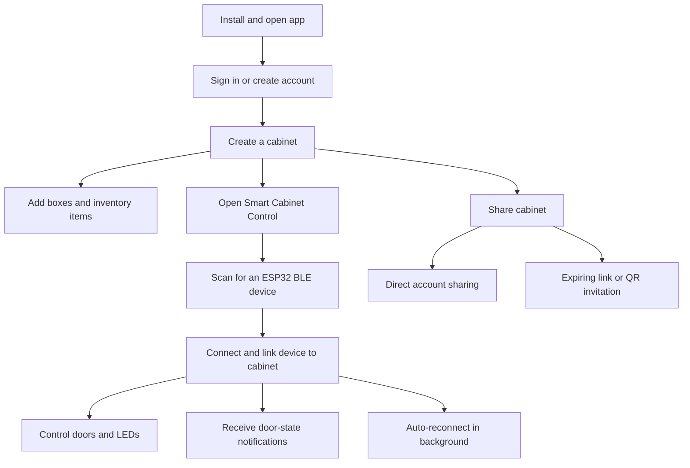

# Smart Cabinet Finder

Smart Cabinet Finder is a Flutter and Firebase inventory application for organizing physical cabinets, boxes, and stored items. It combines real-time inventory, role-based cabinet sharing, expiring QR invitations, notifications, AI-assisted item entry, and Bluetooth Low Energy (BLE) control for a two-door ESP32 cabinet.

## Application flow



For detailed owner, BLE, sharing, installation, and developer flows, see [docs/USER_FLOW.md](docs/USER_FLOW.md).

The current application is primarily developed and tested for Android. Flutter platform folders for iOS, web, Windows, macOS, and Linux are present, but some mobile permissions and `dart:io`-based features require additional work before those targets can be considered production-ready.

## Current feature status

| Area | Status | Description |
| --- | --- | --- |
| Authentication | Integrated | Email/password, Google, phone, anonymous/guest login, password reset, profile update, and account deletion |
| Cabinets and boxes | Integrated | Create, edit, delete, search, favorite, and organize cabinets and boxes |
| Inventory | Integrated | Item CRUD, photos, custom fields, categories, tags, stock counts, withdrawal/return history, expiry dates, and remembered locations |
| Real-time data | Integrated | Firestore snapshot listeners for owned/shared cabinets, boxes, items, categories, and notifications |
| Cabinet sharing | Integrated | Email sharing, bulk sharing, expiring invitations, revocation, and `view`/`edit`/`admin` roles |
| Public QR preview | Integrated backend | An HTTPS invitation lets a person without the app view a limited, read-only cabinet preview in a browser |
| QR scanning inside app | Not integrated | QR generation exists, but the bundled scanner dependency is not connected to a scanner screen; users scan with the phone camera or paste the invitation link |
| BLE cabinet control | Integrated, hardware-dependent | Scan/connect to an ESP32, read two door sensors, move two servos, and control two LEDs |
| Door notifications | Backend-dependent | Realtime Database door events can trigger Firestore logs and FCM notifications |
| Expiry/stock alerts | Backend-dependent | A scheduled Cloud Function checks inventory daily at 08:00 Asia/Kuala_Lumpur |
| AI assistant | Integrated, configuration-dependent | Gemini chat, smart search, image autofill, item counting, medicine information, category/storage suggestions, and cabinet organization |
| Voice input | Integrated, configuration-dependent | Local speech recognition with Azure Speech fallback for short recordings |
| Local/push notifications | Integrated | FCM token registration, local alerts, unread counts, notification settings, and expiry reminders |
| Languages and themes | Integrated | English, Malay, Chinese, light mode, and dark mode |
| CSV/JSON export | Service exists, not connected | Export code exists but is not currently exposed from a main application screen |
| MQTT | Service exists, not connected | A public HiveMQ client service exists but the active cabinet-control UI uses BLE |
| Door Status page | Placeholder | The route exists, but the screen does not yet display live door events |

## Permission model

All cabinet users must be authenticated, except visitors using the limited public invitation preview.

| Role | View cabinet/items | Add or edit items/boxes | Delete items/boxes | Manage sharing |
| --- | ---: | ---: | ---: | ---: |
| Owner | Yes | Yes | Yes | Yes |
| View | Yes | No | No | No |
| Edit | Yes | Yes | No | No |
| Admin | Yes | Yes | Yes | No |

The owner remains the only user allowed to change the cabinet's sharing membership. Firestore rules are defined in `firestore.rules` and must be deployed whenever they change.

## Technology

- Flutter/Dart with Provider state management
- Firebase Authentication
- Cloud Firestore and Firebase Storage
- Firebase Cloud Messaging and local notifications
- Firebase Realtime Database for ESP32 door events
- Firebase Cloud Functions v2 on Node.js 22
- Gemini generative AI
- Azure Speech fallback
- BLE through `flutter_reactive_ble`
- ESP32 firmware/Arduino sketch included in the repository

## Project structure

```text
lib/
  config/       Application constants, Firebase collection names, BLE UUIDs
  l10n/         English, Malay, and Chinese localization resources
  models/       User, cabinet, box, item, category, notification, door-log models
  providers/    Authentication and UI state management
  screens/      Application screens and workflows
  services/     Firebase, sharing, AI, BLE, MQTT, notifications, storage, export
  widgets/      Reusable UI components
functions/
  index.js      Callable, HTTP, scheduled, and Realtime Database functions
firestore.rules Firestore authorization rules
sketch_*/       ESP32/Arduino firmware
test/           Flutter tests
```

## Prerequisites

- Flutter compatible with Dart `>=3.5.0 <4.0.0`
- Android Studio/Android SDK for Android builds
- Node.js 22 and npm for Cloud Functions
- Firebase CLI
- A Firebase project on the Blaze plan for scheduled and Realtime Database functions
- A physical Android device with Bluetooth for BLE testing
- An ESP32 programmed with matching service and characteristic UUIDs

## Local setup

1. Install Flutter packages:

   ```powershell
   flutter pub get
   ```

2. Install Cloud Function packages:

   ```powershell
   Set-Location functions
   npm install
   Set-Location ..
   ```

3. Configure Firebase for each required platform using FlutterFire:

   ```powershell
   flutterfire configure
   ```

   Confirm that `lib/firebase_options.dart` and the native Firebase configuration files belong to the intended project. This repository is currently configured for `smart-cabinet-test-7`.

4. Enable the required Firebase products:

   - Authentication providers used by the app
   - Cloud Firestore
   - Firebase Storage
   - Cloud Functions
   - Firebase Cloud Messaging
   - Realtime Database when using ESP32 door events

5. Create `functions/.env` for optional Azure Speech support:

   ```dotenv
   AZURE_SPEECH_KEY=your-key
   AZURE_SPEECH_REGION=your-region
   ```

6. Run the Android application. Pass a Gemini key only if AI features are required:

   ```powershell
   flutter run --dart-define=GEMINI_API_KEY=your_key
   ```

   Without `GEMINI_API_KEY`, the rest of the application can run, but Gemini-powered features will be unavailable.

## Build an Android APK

```powershell
flutter pub get
flutter build apk --release --dart-define=GEMINI_API_KEY=your_key
```

The APK is generated at `build/app/outputs/flutter-apk/app-release.apk`. The current Android project uses debug signing for release builds; configure a private release keystore before production distribution.

## Firebase deployment

Deploy Firestore authorization rules:

```powershell
firebase deploy --only "firestore:rules"
```

Deploy all Cloud Functions:

```powershell
$env:FUNCTIONS_DISCOVERY_TIMEOUT = "60"
firebase deploy --only "functions"
```

Deploy only the invitation functions:

```powershell
$env:FUNCTIONS_DISCOVERY_TIMEOUT = "60"
firebase deploy --only "functions:createCabinetInvite,functions:viewCabinetInvite,functions:acceptCabinetInvite"
```

The increased discovery timeout is useful on Windows when Firebase's default 10-second function-discovery period is too short.

## Cloud Functions

| Function | Type/region | Purpose |
| --- | --- | --- |
| `shareCabinetByEmail` | Callable, `us-central1` | Add an existing account to a cabinet by email |
| `bulkShareCabinet` | Callable, `us-central1` | Share with several registered email addresses |
| `createCabinetInvite` | Callable, `us-central1` | Create a random, seven-day invitation and HTTPS QR link |
| `viewCabinetInvite` | HTTP, `us-central1` | Render a no-cache, no-index, read-only browser preview |
| `acceptCabinetInvite` | Callable, `us-central1` | Accept a one-time invitation for the signed-in account |
| `listCabinetInvites` | Callable, `us-central1` | List an owner's pending invitations |
| `revokeInvite` | Callable, `us-central1` | Revoke an unused invitation |
| `transcribeVoice` | Callable, `asia-southeast1` | Send a short recording to Azure Speech |
| `checkAzureSpeechAvailability` | Callable, `asia-southeast1` | Report whether Azure Speech is configured |
| `onDoorEvent` | Realtime Database trigger | Store/notify a new ESP32 door event |
| `dailyItemAlerts` | Scheduled | Generate daily expiry and low-stock alerts |

## Sharing workflows

### Direct account sharing

1. The owner opens a cabinet and selects **Share Cabinet**.
2. The owner enters an existing account email and selects `view`, `edit`, or `admin`.
3. The receiving account sees the cabinet under **Manage Cabinets → Shared** through a real-time listener.

### Invitation and QR sharing

1. The owner selects **Create Invite Link/QR Code**.
2. A new HTTPS invitation is generated. Old `smartcabinet://` QR codes do not provide the browser preview.
3. A person without the app can scan the code with the phone camera and view the limited browser preview.
4. A signed-in app user can paste the link under **Shared Cabinets → Join invitation** to add it to their account.

Invitations expire after seven days, can be revoked, and can be accepted by only one account. Browser preview access does not grant edit permission. After an invitation is accepted, expired, or revoked, its public preview becomes unavailable.

## ESP32 and BLE setup

The active mobile control flow uses BLE. The service and characteristic UUIDs in the ESP32 firmware must match `lib/config/app_constants.dart`:

- One primary cabinet service
- Upper door sensor, servo, and LED characteristics
- Lower door sensor, servo, and LED characteristics

On Android, grant Nearby Devices/Bluetooth and location permissions when requested. Connect from **Smart Cabinet Control**, then link the BLE device ID to the corresponding cabinet. Door movement and LED commands require the physical device to be connected.

The MQTT service currently targets the public `broker.hivemq.com` broker without TLS or authentication and is not connected to the main UI. Do not use the current MQTT defaults for sensitive or production deployments.

## Verification

Run formatting, analysis, and tests with:

```powershell
dart format lib test
flutter analyze
flutter test
node --check functions/index.js
```

Latest verification performed for this repository:

- Cloud Function JavaScript syntax: passed
- Firestore rules compilation/deployment: passed
- Flutter tests: 2 passed
- Flutter analysis: no compile errors; 132 warnings/information notices remain

The automated test suite currently covers language-code normalization and fallback only. Authentication, Firestore permissions, sharing, notification delivery, browser invitations, AI calls, and BLE hardware still require integration/device tests.

## Known limitations and production checklist

1. **Protect AI credentials.** The app reads `GEMINI_API_KEY` through `--dart-define`; mobile binaries still cannot safely hold private credentials. For production, proxy AI calls through an authenticated server endpoint and restrict/rotate any key previously used in an APK.
2. **Configure Firebase App Check or leave enforcement disabled.** The app currently has no App Check provider. Enabling enforcement now can reject Firestore and callable-function requests.
3. **Complete iOS permissions.** The current iOS plist includes Bluetooth descriptions but needs appropriate camera, photo-library, microphone, notification, and URL/deep-link configuration for all mobile features.
4. **Finish automatic deep-link handling.** Android declares the `smartcabinet://join` intent filter, but the app does not currently consume incoming links automatically. Pasting an HTTPS link into **Join invitation** is the reliable acceptance flow.
5. **Add an in-app QR scanner if desired.** `mobile_scanner` is installed but not yet used by a screen.
6. **Connect or remove dormant services.** CSV/JSON export and MQTT code exist but are not reachable from the main UI.
7. **Implement the Door Status page.** It is currently a placeholder.
8. **Resolve analyzer debt.** Remaining findings include deprecated Flutter properties, unused imports/fields, async `BuildContext` warnings, style notices, and generated localization notices.
9. **Expand tests.** Add Firebase Emulator tests for permission roles and sharing, widget tests for major screens, and device tests for BLE/notifications.
10. **Review Realtime Database security.** ESP32 door writes use separate Realtime Database rules; Firestore rules do not protect that database.

## Troubleshooting

### Shared cabinet does not appear

- Confirm the receiving account is signed in with the intended Firebase UID.
- Deploy `firestore.rules`.
- Confirm the cabinet document contains that UID in `sharedWith`.
- Install/run the latest app build; the Shared tab updates from a live snapshot.
- A public browser preview alone does not add a cabinet to an account.

### Firestore reports a missing index

The main real-time cabinet, box, item, and category flows sort results locally and should not require the earlier `field + name` composite indexes. If a different query reports `FAILED_PRECONDITION`, use the index link in the Firebase log or change the query and rules deliberately.

### Function deployment times out at `Serving at port ...`

```powershell
$env:FUNCTIONS_DISCOVERY_TIMEOUT = "60"
firebase deploy --only "functions" --debug
```

Increase the value to `120` on a particularly slow Windows environment.

### `No AppCheckProvider installed`

This is a warning while App Check enforcement is disabled. Configure a platform App Check provider before enabling enforcement.

### BLE shows unauthorized

Grant Bluetooth/Nearby Devices and location permissions, enable Bluetooth and location services, and retry on a physical Android device.

## License

No license file is currently included. Add a license before distributing the project publicly.
