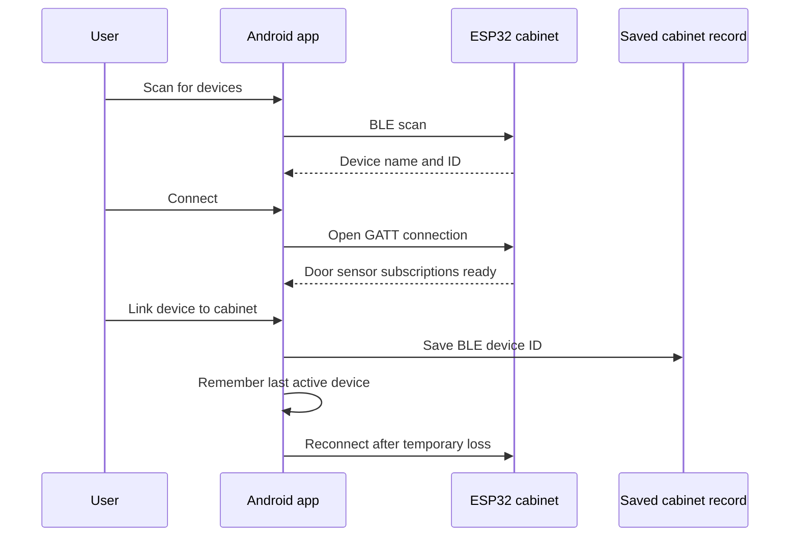
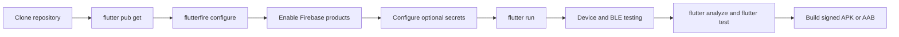

# Smart Cabinet Finder flows

This document describes the main user and developer journeys for Smart Cabinet Finder.

## Owner setup flow

1. Install the Android APK and grant notification, Bluetooth/Nearby Devices, and location permissions.
2. Register or sign in.
3. Open **Manage Cabinets** and select **Add Cabinet**.
4. Enter a cabinet name, location, and optional description.
5. Add boxes and inventory items to the cabinet.
6. Open **Smart Cabinet Control** to connect physical hardware.

## BLE cabinet flow

- Each cabinet may store a different BLE device ID.
- The app lists linked devices under **Smart Cabinet Control → My BLE Cabinets**.
- **Manage Cabinets** shows how many BLE devices are linked and whether one is active.
- One cabinet is actively connected at a time for stability.
- Android displays an ongoing notification while maintaining the background connection.
- Force-stopping the app terminates the connection; reopening it starts automatic reconnection.

## Cabinet management flow

1. Open **Menu → Manage Cabinets**.
2. Use **My Cabinets** for cabinets you own.
3. Tap a card to view it or the edit icon to update it.
4. Tap the red trash icon and confirm to delete the cabinet record.
5. Use **Shared** for cabinets owned by someone else.

Deleting a cabinet does not delete its existing item and box records. Shared users cannot delete a cabinet they do not own.

## Sharing flow

### Direct sharing

1. The owner opens **Share Cabinet**.
2. Enter an existing account email.
3. Select `view`, `edit`, or `admin` permission.
4. The recipient finds it under **Manage Cabinets → Shared**.

### Invitation link or QR

1. The owner creates an expiring invitation.
2. Share the HTTPS link or QR code.
3. A guest can view the limited browser preview.
4. A signed-in app user can paste the invitation into **Shared Cabinets → Join invitation**.

## Developer setup flow

Use a physical Android device for BLE testing. The ESP32 service and characteristic UUIDs must match `lib/config/app_constants.dart`.

## Release flow

1. Update `version` in `pubspec.yaml`.
2. Run `dart format lib test`, `flutter analyze`, and `flutter test`.
3. Build with a production signing key.
4. Use `flutter build appbundle --release` for Google Play or `flutter build apk --release` for direct distribution.
5. Tag the Git commit, for example `v1.0.2`.
6. Create a GitHub Release and attach the APK only if its embedded configuration is safe for public distribution.
